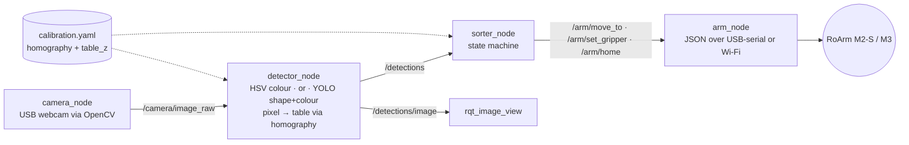

# IntelPick: architecture and assumption check

Goal: a webcam looks down at a table with coloured objects (cubes, bottle caps, 3D-printed
shapes). The system finds each object and a Waveshare RoArm picks it up and drops it into the
bin for its colour or shape.

## 1. Checking the original sketch

Checked 2026-09-23 against the Waveshare wiki, the `waveshareteam/roarm_ws` repo, the Ultralytics
docs, and this machine's WSL2 setup.

| # | Assumption | Verdict | What is actually true / what to do |
|---|---|---|---|
| 1 | "YOLO is ready, no need to train it" | **Partly false** | Pretrained COCO weights have 80 classes; *cube* and *bottle cap* are not among them, and **no YOLO class encodes colour**. Colour sorting needs no neural net: HSV thresholding in OpenCV is faster and more reliable. YOLO earns its place for **shapes**: fine-tune on ~150–300 of your own labelled photos (transfer learning, not training from scratch). |
| 2 | "YOLOv8, installed with one command" | **True, with a catch** | `pip install ultralytics` works. The current Ultralytics model is **YOLO26**, with the same API (only the weights name changes); YOLOv8 still works. **Catch:** pip pulls in NumPy 2.x, which breaks ROS Humble's `cv_bridge` (built against NumPy 1.21). Install with `pip install ultralytics "numpy<2"`. Licence is AGPL-3.0: fine for a student project, not for closed commercial use. |
| 3 | "OpenCV, 1 command" | **True, already done** | OpenCV 4.5.4 is already installed in WSL (`python3-opencv` from the ROS install). Don't also `pip install opencv-python`; two copies conflict. |
| 4 | "RoArm probably has a ready ROS 2 driver" | **True (M2-S and M3)** | [`waveshareteam/roarm_ws`](https://github.com/waveshareteam/roarm_ws) targets **ROS 2 Humble on Ubuntu 22.04**, exactly what this WSL has. But its XYZ services (`/move_joint_cmd`, …) sit on top of **MoveIt 2**, which is heavy and not installed. This project uses a **thin driver of its own** (`arm_node`) that speaks the arm's documented JSON protocol (`T:104` move to XYZ, `T:105` read position, `T:106` gripper) over USB-serial or Wi-Fi. `roarm_ws` is still useful later for the URDF and RViz. The old RoArm-M1 uses a different protocol. |
| 5 | "Any USB webcam" | **True, but WSL can't see it by default** | WSL2 does not see USB devices until they are forwarded with **usbipd-win** (installed, v5.3.0). The WSL kernel (6.18) includes `uvcvideo` (webcams) and `cp210x` (the M2-S board's CP2102 USB-serial chip, VID:PID `10c4:ea60`), so forwarding will work. USBPcap is installed on this PC, so `usbipd bind` needs `--force`. Use MJPG at 640×480 to keep USB/IP bandwidth low. **Wi-Fi cameras need no usbipd:** `camera:=http://…` or `rtsp://…` works too (phone app for now). The arm can also go over its own Wi-Fi AP (`host:=192.168.4.1`). |
| 6 | "YOLO → ROS 2 passes coordinates → arm" | **Missing a step** | YOLO outputs **pixels**; the arm needs **millimetres in its own frame**. You need a **camera→table calibration** (a homography, since the table is flat). One webcam, no depth camera: this works because every object lies on the same plane. Tool: `ros2 run intelpick calibrate`. |
| 7 | "Little code, libraries do 80%" | **Mostly true** | This draft is ~900 lines of Python, including comments. Most of the real effort goes into things libraries don't do: calibration, HSV tuning under your lighting, grasp heights, reach limits, and the arm blocking the camera while it moves. |
| 8 | "Cheap" | **True** | Webcam + coloured objects + the arm you have. A fixed top-down camera mount (phone holder, desk lamp arm) matters more than camera quality. |

### Risks not in the sketch

- **Grasp geometry (check first on the real arm).** The RoArm-M2-S is 4-DOF (base, shoulder, elbow,
  clamp). XYZ already uses the first three joints, so **the clamp's pitch can't be commanded**: it
  is whatever the inverse kinematics gives for that point. Hence the default `approach: radial`:
  descend a few cm short of the object, then slide outward along the base→object line so the
  object enters the jaws from the side (`intelpick/grasp.py`). `ros2 run intelpick probe_arm`
  moves the clamp to table height at several distances so you can watch; switch to
  `approach: vertical` if it turns out the clamp can come straight down.
- **Object size vs. jaw opening.** The clamp opens up to 135° (1.08 rad) and closes at 3.14 rad.
  Pick cubes/caps that fit with margin (≈2–3 cm). Round caps are easier: orientation doesn't matter.
- **Missed grasps.** Feedback (`T:105`) reports the measured clamp angle. Closing on an object
  stalls the jaws early, so the sorter treats "closed almost fully" as *nothing grabbed*, lifts and
  retries instead of carrying air to the bin (`check_grasp`, `empty_grip_margin`, measured by
  `probe_arm`). The squeeze is limited with `T:107` (`grip_torque`, default 30 %) so a stalled
  servo doesn't overheat.
- **Sorted objects get detected again.** Keep the bins outside the camera's pick zone (`roi` param).
- **The arm blocks the view.** The sorter only trusts detections after the arm is home and a stable
  object has been seen for N frames in a row.
- **Lighting.** HSV ranges drift between daylight and lamps. Tune under demo conditions.

## 2. System shape

| Package / file | Role |
|---|---|
| `intelpick_interfaces` | `Detection`, `DetectionArray` msgs; `MoveTo`, `SetGripper` srvs |
| `intelpick/camera_source.py` | Opens USB (V4L2) or network (HTTP/RTSP) cameras; newest frame only, reconnects after Wi-Fi drops |
| `intelpick/camera_node.py` | Camera → `sensor_msgs/Image` |
| `intelpick/detectors/color.py` | HSV masks → blobs (centroid, angle, fill ratio as confidence) |
| `intelpick/detectors/yolo.py` | Ultralytics model → boxes, optionally tagged with dominant colour (`red_cube`) |
| `intelpick/detector_node.py` | Runs a backend, applies ROI + calibration, publishes detections + overlay |
| `intelpick/calibration.py` | Fit / load / apply the pixel → table homography; remembers the image size |
| `intelpick/roarm.py` | ROS-free RoArm client (serial / HTTP / dry-run), M2 vs M3 command format |
| `intelpick/arm_node.py` | ROS services around `roarm.py`; metres in ROS, mm on the wire |
| `intelpick/sorter_node.py` | Stable target → hover → descend → grip → lift → bin → release → home |
| `intelpick/grasp.py` | Pick waypoints: `radial` (M2-S default) or `vertical` |
| `intelpick/probe_arm.py` | Hardware bring-up: link, blocking behaviour, clamp angles, table height, reach |
| `intelpick/calibrate.py` | Interactive tool: click a marker, touch it with the limp arm, SPACE |
| `config/intelpick.yaml` | Every tunable: HSV ranges, ROI, bins, heights, reach, speeds |

Conventions: arm frame per Waveshare docs, origin at the base, **+X forward, +Y left, +Z up**.
ROS topics use **metres**; the JSON protocol uses **millimetres**.

### Where the AI is

1. **Colour** → HSV (deterministic, no training): the baseline, and it works on day 1.
2. **Shape** → YOLO26n fine-tuned on your objects (`backend: yolo`). With `yolo_color_tag`, labels
   become `red_cube`, `blue_star`, …, so bins can sort by colour, shape, or both.
3. Stretch: a YOLO **OBB** model to get object rotation for aligning the M3 wrist roll (the
   `angle` field already exists in `Detection`).

## 3. Milestones

| # | Milestone | Done when |
|---|---|---|
| M0 | USB into WSL | `/dev/video0` and `/dev/ttyUSB0` visible in Ubuntu |
| M1 | Arm alone | `probe_arm` run end to end; its measured values copied into the config; `approach` chosen; `ros2 service call /arm/move_to …` moves the real arm |
| M2 | Vision alone | Stable colour detections in `rqt_image_view` under demo lighting |
| M3 | Calibration | RMS < 5 mm; arm hovers exactly over a detected object |
| M4 | Colour sorting loop | 10 objects sorted unattended; log success rate |
| M5 | Shape model | Dataset (~200 imgs) → `yolo train` → `backend:=yolo` sorting by shape |
| M6 | Demo | Video, success rate, picks/min, slide with this diagram |

## 4. Status of this draft

Target hardware: **RoArm-M2-S** (confirmed). The M3 code path is kept but secondary.

Verified here (WSL, no hardware): both packages build; 16 unit tests pass (colour detection,
calibration round-trip and image-size check, radial/vertical grasp paths, M2/M3 command encoding,
gripper feedback and torque, network camera against a local MJPEG server incl. reconnect);
a launch with `camera:=http://…` streamed, detected and sorted; `probe_arm --dry-run` runs all its steps; a full `ros2 launch` in `dry_run` with a
synthetic camera image detected the object, mapped it to the right table position and ran
complete pick-and-place cycles including the grasp check.

**Not yet verified on hardware** (all measured by `probe_arm`): serial link, whether `T:104`
blocks feedback while moving, real clamp angles empty vs. holding, table height, reach at table
height, and how the clamp meets the table.
